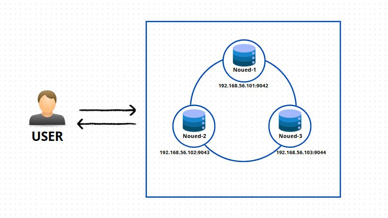

# 📌 **Projet : Atelier Apache Cassandra Cluster**

Ce projet vise à configurer un cluster **Apache Cassandra** afin de comprendre ses mécanismes internes.  
Il met en lumière des concepts clés tels que :  

✅ **Répartition des données** via le partitionnement.  
🔄 **Réplication** pour assurer la disponibilité et la tolérance aux pannes.  
⚖️ **Stratégies de cohérence** pour le maintien de l'intégrité des données.  

L'environnement est déployé à l'aide de **Docker** pour simplifier le processus de mise en place et permettre des tests en local.

Voici l'architecture utilisée dans cette configuration :



## Prérequis

Avant de commencer, assurez-vous que les outils suivants sont installés et configurés sur votre machine :

- **Docker** : Assurez-vous que Docker est installé et en cours d'exécution sur votre machine. [Télécharger Docker](https://www.docker.com/get-started)
- **PowerShell** : Utilisez PowerShell en tant qu'administrateur pour exécuter les scripts nécessaires.

## Installation

### Étapes pour démarrer le projet :

1. **Clonez le repository** :

   Clonez ce repository GitHub sur votre machine locale :

   ```bash
   git clone https://github.com/Josef3215/atelier_2.git
   cd votre-repository
2. **Téléchargez les données** :


